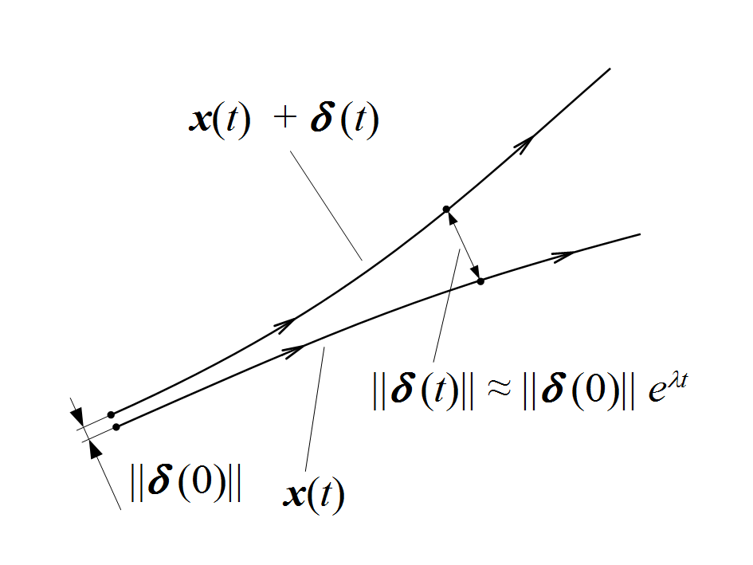
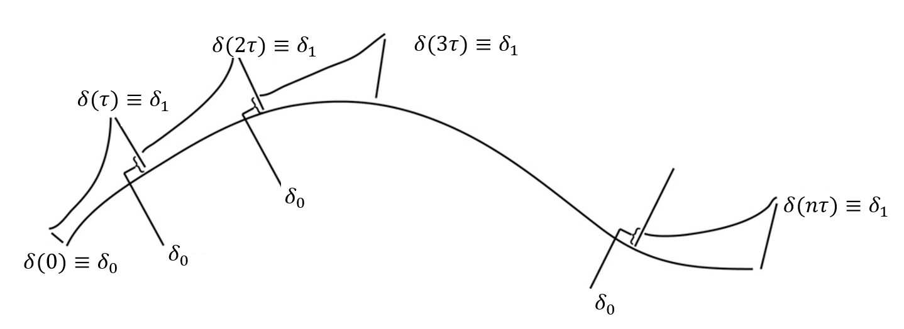

# Largest Lyapunov Exponent for 3D flows

The **Largest Lyapunov Exponent (LLE)** quantifies chaos by measuring sensitivity to initial conditions. Here, we'll estimate the LLE for the classical Lorenz attractor, a canonical chaotic system.

{ width=60%}
*Source: [Wikipedia – Lyapunov exponent](https://en.wikipedia.org/wiki/Lyapunov_exponent)*


1. **Load the required packages**

```{r message=FALSE, warning=FALSE}
library(ggplot2)
library(deSolve)
```

2. **Define the Lorenz system**

The Lorenz system is defined by:

$$
\begin{aligned}
\dot{x} &= \sigma \cdot (y - x) \\
\dot{y} &= x \cdot (\rho - z) - y \\
\dot{z} &= x \cdot y - \beta \cdot z
\end{aligned}
$$

Lorenz originally used the values $\sigma = 10$, $\rho = 28$, and $\beta = 8/3$, under which the system exhibits chaotic behavior.

```{r}
lorenz <- function(t, state, parameters) {
  with(as.list(c(state, parameters)), {
    dx <- sigma * (y - x)
    dy <- x * (rho - z) - y
    dz <- x * y - beta * z
    list(c(dx, dy, dz))
  })
}
```

3. **Start with any initial condition in the basin of attraction and iterate until the orbit is on the attractor**.

```{r}
# Parameters
parms <- c(sigma = 10, rho = 28, beta = 8/3)

# Initial conditions and integration settings
state_aux <- c(x = 1, y = 1, z = 1)
dt <- 0.01
total_time <- 200
times <- seq(0, total_time, by = dt)

# Integrate to reach attractor
orbit_aux <- ode(state_aux, times, lorenz, parms, method = "ode45")
orbit_aux_df <- as.data.frame(orbit_aux)
```

4. **Visualize the Lorenz attractor**

```{r}
ggplot()+
  geom_path(data = orbit_aux_df, 
            aes(x = x, y = z), color = "blue")+
  geom_point(data = data.frame(x=state_aux["x"],y=state_aux["y"],z=state_aux["z"]), 
             aes(x = x, y = z), color = "red", size = 3)+
  labs(title = "The Lorenz attractor")+
  coord_fixed()+
  theme_bw()
```

5. Select the last point of the previous orbit. It should be in the attractor.

```{r}
# Select final state
state <- orbit_aux[nrow(orbit_aux),c("x","y","z")]
```

6. Select a nearby point (separated by $\delta_0$).

```{r}
# Define initial nearby point separated by small d0
d0 <- 1e-8
state_perturbed <- state + c(d0, 0, 0)
```

7. Advance both orbits one iteration and calculate new separation $\delta_1$.
```{r}
# Advance both states by one iteration (time step dt)
orbit1 <- ode(state, c(0, dt), lorenz, parms, method = "ode45")[2,-1]
orbit2 <- ode(state_perturbed, c(0, dt), lorenz, parms, method = "ode45")[2,-1]
  
# Calculate new separation d1
d1_vector <- orbit2 - orbit1
d1 <- sqrt(sum(d1_vector^2))
```
8. Evaluate $log |\delta_1/\delta_0|$ in any convenient base.

```{r}
# Evaluate log(d1/d0)
log(d1/d0)
```

9. Readjust one orbit so its separation is $\delta_0$ in same direction as $\delta_1$.
```{r}
# Readjust perturbed orbit to separation d0
state <- orbit1
state_perturbed <- orbit1 + (d0 / d1) * d1_vector
```
  
10. We use a for loop to repeat the previous 3 steps and obtain new values of $\log |\delta_1/\delta_0|$.

{ width=80%}

*Source: [Numerical calculation of the largest Lyapunov exponent](https://www.researchgate.net/figure/Numerical-calculation-of-the-largest-Lyapunov-exponent_fig14_305809930)*

11. the largest Lyapunov exponent is the average value of $\lambda_1 = <\log |\delta_1/\delta_0|>$.

```{r}
# Parameters for Lyapunov exponent calculation
n_iter <- 1e4
lyapunov_sum <- 0

# Loop to calculate Lyapunov exponent
for (i in 1:n_iter) {
  
  # Advance both states by one iteration (time step dt)
  orbit1 <- ode(state, c(0, dt), lorenz, parms, method = "ode45")[2,-1]
  orbit2 <- ode(state_perturbed, c(0, dt), lorenz, parms, method = "ode45")[2,-1]
  
  # Calculate new separation d1
  d1_vector <- orbit2 - orbit1
  d1 <- sqrt(sum(d1_vector^2))
  
  # Evaluate log(d1/d0)
  lyapunov_sum <- lyapunov_sum + log(d1/d0)
  
  # Readjust perturbed orbit to separation d0
  state <- orbit1
  state_perturbed <- orbit1 + (d0 / d1) * d1_vector
}

# Calculate largest Lyapunov exponent
l1 <- lyapunov_sum / (n_iter * dt)

# Print the result
cat("Largest Lyapunov exponent:", l1, "\n")
```

# Interpretation

- **Positive LLE**: Indicates sensitive dependence on initial conditions and exponential divergence of trajectories (chaos).
- **Larger LLE**: Suggests more sensitive dependence on initial conditions.

```{r}
if (l1 > 0) {
  cat("The system shows chaotic behavior.\n")
} else {
  cat("The system does not show chaotic behavior.\n")
}
```
# Further exploration

Try varying the initial conditions and parameters ($\sigma$, $\rho$, $\beta$) to explore different dynamical regimes. For instance, estimate the largest Lyapunov exponent of the Lorenz system under the following parameter set: $\sigma = 10$, $\rho = 350$, $\beta = 8/3$
